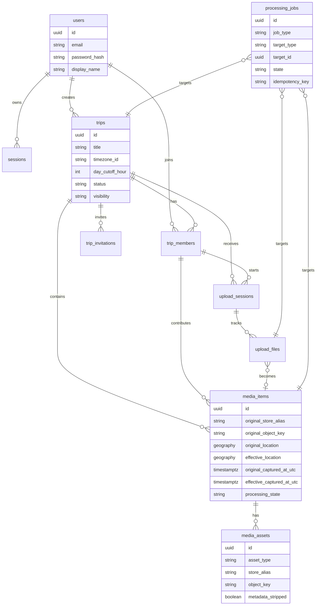
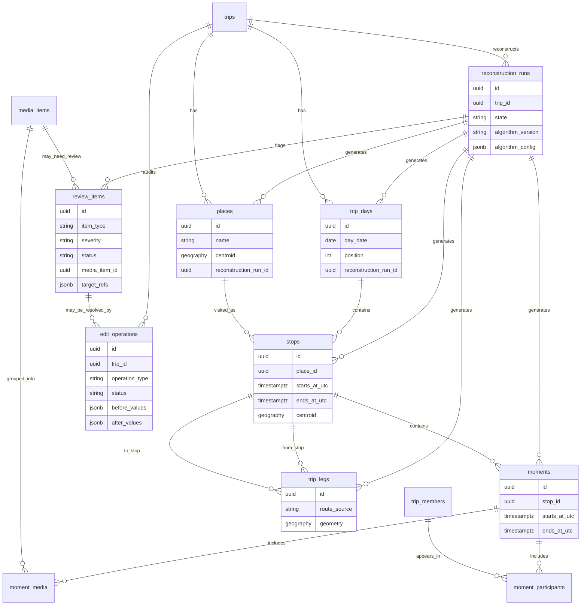

# Domain Model

TripWeave turns multiple travelers' camera rolls into one shared trip story.

## Core Concepts

`Trip` is the shared event being reconstructed. It has owners, contributors, media, derived timeline structure, review state, and publication versions.

`Contributor` is a person who adds media to a trip. Contributors retain ownership and deletion control over their uploaded media.

`MediaAsset` is an uploaded original photo or video record. It references immutable content by logical `store_alias` and `object_key`.

`OriginalMetadata` is extracted metadata from the original file, such as capture timestamp, timezone clues, GPS coordinates, device identifiers, and file properties. It is immutable.

`Correction` is a user-provided adjustment to timestamp, timezone, location, visibility, ownership, or grouping. Corrections are stored separately from originals.

`EffectiveMetadata` is the resolved value used by the product. User corrections outrank automated results, and automated results outrank missing or uncertain original values only when allowed by the relevant rule.

`AutomatedResult` is a machine-derived suggestion or computed value. It always records source, confidence, and algorithm version.

`Day`, `Stop`, and `Moment` are derived timeline groupings. Days represent trip calendar days, stops represent meaningful places or movement clusters, and moments represent smaller narrative clusters within stops.

`ReviewException` is a missing, conflicting, low-confidence, or policy-sensitive issue that needs human attention.

`StoryPublication` is a versioned published snapshot of map, timeline, text, media derivatives, visibility decisions, and sanitized geometry.

## Stage 2 Domain Foundation

Stage 2 intentionally stores only provider-neutral blob identity through `store_alias` and `object_key`. It does not introduce authentication flows, upload endpoints, media processing, cloud adapters, story publication tables, or provider-specific storage fields.

## Reconstruction Foundation

Reconstruction records are generated results. Each generated table records `source`, `confidence`, `algorithm_version`, `reconstruction_run_id`, `user_locked`, `created_at`, and `updated_at`. Reruns replace unlocked generated records while preserving locked human edits.

Review items use a fixed exception taxonomy: `unknown_time`, `unknown_location`, `possible_wrong_day`, `possible_stop_merge`, `possible_stop_split`, `possible_clock_offset`, `unassigned_media`, and `failed_media_processing`. Organizer corrections create auditable `edit_operations` with before/after values. Corrected generated records are marked `user_locked` so reruns preserve human decisions.

## Invariants

- Original files are immutable.
- Original metadata is immutable.
- Effective corrected values are stored separately.
- User corrections outrank automation.
- Automated results include source, confidence, and algorithm version.
- Contributors retain ownership and deletion control over their media.
- Published stories contain sanitized derivatives, never originals.
- Persist logical `store_alias` and `object_key`, not signed URLs or permanent provider URLs.
- Authorization rules require tests.

## Ownership And Deletion

Each original media asset has an owning contributor. A contributor can delete or withdraw their media according to product policy and authorization rules. Deletion must remove or disable future use of original content and regenerate affected derivatives and publication versions when necessary.

Published story versions must be able to show that removed contributor media is no longer available in newly published versions. If takedown semantics require modifying already published content, that behavior must be explicit and tested.

## Metadata Resolution

Metadata resolution is ordered:

1. User correction
2. Accepted automated result
3. Original metadata
4. Unknown value

The system must preserve the evidence trail. It should be possible to explain why an effective timestamp, location, or grouping was selected.

## Review By Exception

The default workflow should avoid forcing users to inspect every asset. The application highlights exceptions such as missing timestamps, timezone conflicts, inconsistent GPS tracks, duplicate media, low-confidence clustering, ownership concerns, and publication privacy warnings.

Review actions produce corrections or approvals that are auditable and independent from immutable originals.

## Publication Model

Publication creates a versioned story. Published data is a sanitized derivative snapshot, not a live view over originals.

A story version may include:

- ordered days
- stops and moments
- selected media derivatives
- map geometry appropriate for publication
- captions and narrative text
- attribution
- visibility rules

Publication must not expose original files, original metadata dumps, private storage paths, signed URLs as permanent records, or provider-specific details.
